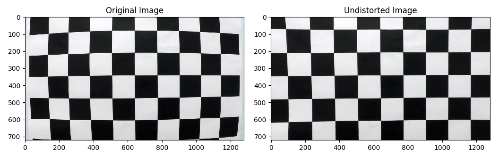
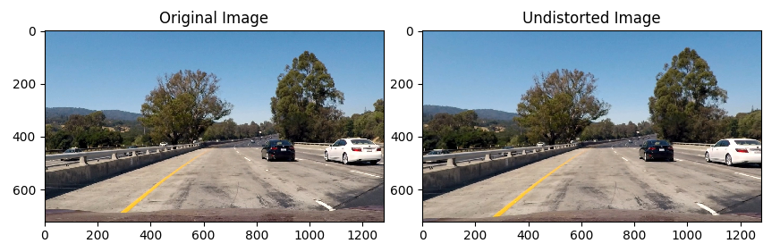
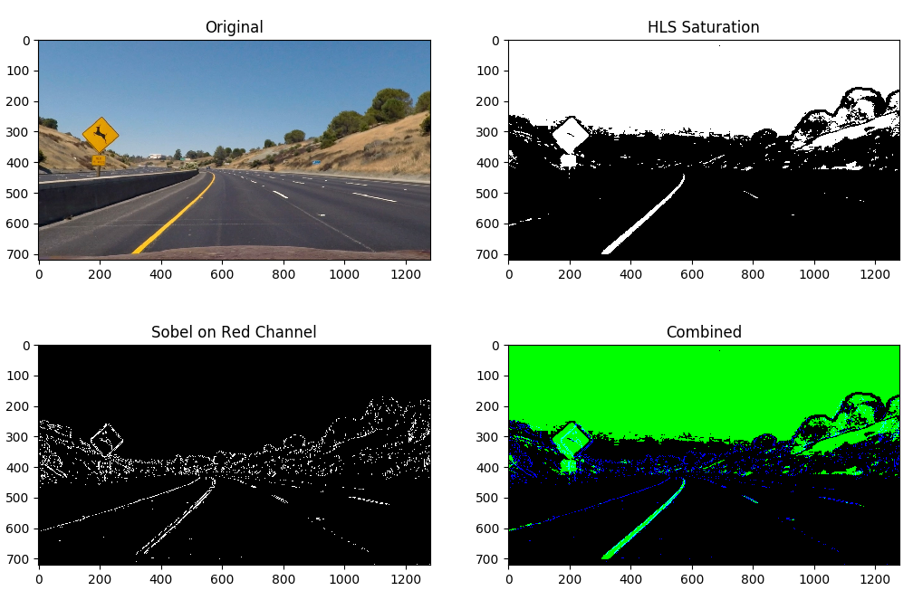
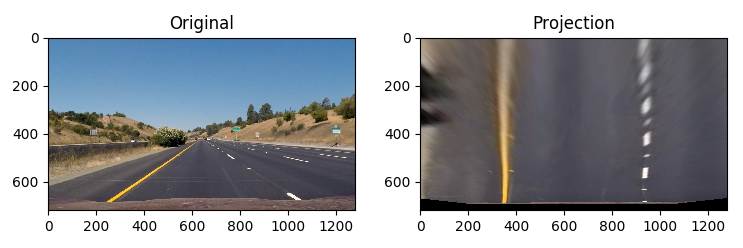
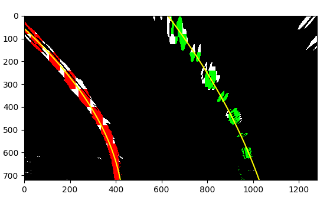
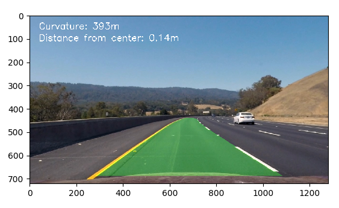

# Advanced Lane Finding Project

The present file illustrates my solution of the [Udacity Advanced Lane Finding Project](https://github.com/udacity/CarND-Advanced-Lane-Lines).

---

The goals / steps of this project are the following:
* Compute the camera calibration matrix and distortion coefficients given a set of chessboard images.
* Apply a distortion correction to raw images.
* Use color transforms, gradients, etc., to create a thresholded binary image.
* Apply a perspective transform to rectify binary image ("birds-eye view").
* Detect lane pixels and fit to find the lane boundary.
* Determine the curvature of the lane and vehicle position with respect to center.
* Warp the detected lane boundaries back onto the original image.
* Output visual display of the lane boundaries and numerical estimation of lane curvature and vehicle position.

---

## [Rubric Points](https://review.udacity.com/#!/rubrics/571/view)

**Here I will consider the rubric points individually and describe how I addressed each point in my implementation.**

---

### Writeup / README

##### 1. Provide a Writeup / README that includes all the rubric points and how you addressed each one.
This is the present file.

---

### Camera Calibration

##### 1. Briefly state how you computed the camera matrix and distortion coefficients.

I created a function called `calibrate_camera` at the line 100 of file `main.py`.

It goes through the "camera_cal" folder and try to detect all corners of the chessboard by using the `cv2.findChessboardCorners` function.
If we detect all the corners we are expecting, it then uses those coordinates and project them in the 3d space on a plane z=0 at pre-defined positions.
Once we have our list of points on the picture and in projected 3d space. We can use the `cv2.calibrateCamera` function to create the camera matrix and distortion coefficients.

We can then easily apply it on any picture by using the `cv2.undistort` function.

 

---

### Pipeline (test images)

##### 1. Provide an example of a distortion-corrected image.

I used the pre-calculated calibration parameters and directly applied the `cv2.undistort` function.

 


##### 2. Describe how you used color transforms, gradients or other methods to create a thresholded binary image.

I created a function called `create_binary` at the line 174 of file `main.py`.

It combines color threshold on the saturation channel of the HLS representation of an image as well as a sobel filter in the "x" direction of red channel of the picture.

```python
# Create a filter based on the saturation channel of HLS format
hls = cv2.cvtColor(image, cv2.COLOR_BGR2HLS)
s_channel = hls[:, :, 2]
s_thresh = 90, 255
s_binary = np.zeros_like(s_channel)
s_binary[(s_channel > s_thresh[0]) & (s_channel <= s_thresh[1])] = 1

# Create a filter based on sobel in x direction on red channel
r_channel = image[:, :, 2].astype(np.float)
rsobel_thresh = 30, 100
sobel_abs = np.absolute(cv2.Sobel(r_channel, cv2.CV_64F, 1, 0))
sobel_abs = np.uint8(255 * sobel_abs / np.max(sobel_abs))
rsobel_binary = np.zeros_like(r_channel)
rsobel_binary[(sobel_abs > rsobel_thresh[0]) & (sobel_abs <= rsobel_thresh[1])] = 1

# Combine both filters
combined_binary = np.zeros_like(s_binary)
combined_binary[(s_binary == 1) | (rsobel_binary == 1)] = 1
```

Those 2 independent filters were found experimentally and appeared to be complementary as we can see on the below example.

 


##### 3. Describe how you performed a perspective transform.

I created a function called `create_transform_matrix` at the line 217 of file `main.py`.
I measured coordinates of points from the picture `straight_lines1.jpg` on the straight lines and defined where to project them to have a realistic top view.
I then used the `cv2.getPerspectiveTransform` to create the transformation matrices.

```python
# Standard sizes of the pictures
size_x, size_y = 1280, 720

# We defined straight points from the road on picture straight_lines1.jpg
front_view_corners = np.float32([[248, 690], [1057, 690], [611, 440], [667, 440]])

# We define desired projections
top_view_corners = np.float32([[350, size_y], [size_x - 350, size_y],
                                [350, 0], [size_x - 350, 0]])

# We create the transform matrixes
M = cv2.getPerspectiveTransform(front_view_corners, top_view_corners)
Minv = cv2.getPerspectiveTransform(top_view_corners, front_view_corners)
```

Then, I created the function `create_transform` at line 237 of `main.py` which uses the calculated matrices and the function `cv2.warpPerspective` to project the picture. I verified on a few test images that I would obtain parallel lines.

 


##### 4. Describe how you identified lane-line pixels and fit their positions with a polynomial.

I created a function called `define_polynom_and_curvatures` at the line 262 of file `main.py`.

It uses 2 different functions: `find_lane_points_no_basis` and `find_lane_points_previous_reference`. The function used will depend on whether we know where to search or not.

If we don't know where to search, we will split the image horizontally and will perform some convolutions on the right and left sides to find the position that contains the most pixels. We will assume that those positions identify the lanes of the road and select the pixels present within those windows.

If we can use previously processed frames, we know the lanes should not have moved much and we can directly search around the position we had found.

Once the pixels have been identified, we use the `numpy.polyfit` function which will interpolate our points with a polynom.

For more details, please refer to commented code, lines 262-397 of file `main.py`.




##### 5. Describe how you calculated the radius of curvature of the lane and the position of the vehicle with respect to center.

I created a function called `calculate_curvature_and_center` at the line 400 of file `main.py`.

I processed the file `straight_lines2.jpg` by correcting for distortion and projecting it in top view and then measured distances between lanes and dashed lanes to create a conversion between pixels and meters in each dimension.
I then defined a center line which was the middle between the left and right lanes, converted it into real coordinates and interpolated with a 2nd degree polynom by using the function `numpy.polyfit` to define the second degree polynom in real coordinates. Some formulas exist obtain the curvature from this polynom. The distance from center was just the difference between the x position at the bottom of the image and the middle of the image (I assumed the camera to be at the center of the vehicle and the picture to be perfectly centered).

```python
# Define conversions in x and y from pixels space to meters, measured on projection of straight_lines2.jpg
ym_per_pix = 30/500 # meters per pixel in y dimension
xm_per_pix = 3.7/600 # meters per pixel in x dimension

# Define a few parameters we will need
y_eval = 720 # Location where we calculate curvature
ploty = np.linspace(0, y_eval-1, 5)  # 5 points are more than enough to define a 2nd degree polynom

# Define a center line between left and right lanes
left_fitx = left_fit[0]*ploty**2 + left_fit[1]*ploty + left_fit[2]
right_fitx = right_fit[0]*ploty**2 + right_fit[1]*ploty + right_fit[2]
center_fitx = (left_fitx + right_fitx) / 2.

# Fit new polynomials to x,y in world space using the center line
center_fit = np.polyfit(ploty, center_fitx, 2)
center_fit_cr = np.polyfit(ploty*ym_per_pix, center_fitx*xm_per_pix, 2)

# Calculate the radius of curvature
curv = ((1 + (2*center_fit_cr[0]*y_eval*ym_per_pix + center_fit_cr[1])**2)**1.5) / np.absolute(2*center_fit_cr[0])

# Calculate distance from center
center_fit_basis = center_fit[0]*y_eval**2 + center_fit[1]*y_eval + center_fit[2]
dist_from_center = (center_fit_basis - 1280/2) * xm_per_pix

# Now our radius of curvature is in meters
return curv, dist_from_center
```


##### 6. Provide an example image of your result plotted back down onto the road such that the lane area is identified clearly.

I created a function called `identify_lanes_curvature_center` at the line 438 of file `main.py`.

It uses in sequence all the functions described previously to identify the lanes, curvature and distance from center of a picture. It then projects it back to the front view and superposes it to the original picture.



---

### Pipeline (video)

##### Provide a link to your final video output.

Here's a [link to my video result](output_images/project_video_processed.mp4)

---

### Discussion

Here I will discuss the main difficulties I faced and how I approached them.


##### Projection from front view to top view

At first, I was trying to project a too long distance of the road to a top view. It made the line detection more difficult because the binary filters are not robust far on the road. Also, the points in the distance have a much lower resolution and will create more approximation and error on the projected picture. Another issue is that we identify road curvatures that are too far on the road, which may still be straight for a reasonable distance. Finally, this would make the program even less robust if the road becomes sloppy as we won't identify correctly the distances and could incorrectly project pixels that are not part of the road.
Limiting the distance that we try to project makes the program more robust. I could limit it even more in my own implementation.


##### Prevent jittering of lanes

To avoid jittering of the lanes, an efficient method was to record the lane position and use an exponential moving average. Since it was creating a lag in the lane identification, I decided to define the coefficient factor based on the confidence I had on the definition of lanes.
This confidence is measured based either on the distance between the previous and new identifications of the lanes or on the measurement of their parallelism.

```python
# thresholds to define quality of the fits have been defined experimentally
left_diff = np.sum(np.abs(left_fitx - prev_left_fitx))
right_diff = np.sum(np.abs(right_fitx - prev_right_fitx))
diff = left_fitx - right_fitx
avg_distance = np.average(diff)
parallelism = np.sum(np.abs(diff - avg_distance))
if ((left_diff < 200) and (right_diff < 200)) or parallelism < 300:
    coeff = 1
    self.last_detected = 0
elif ((left_diff < 350) and (right_diff < 350)) or parallelism < 400:
    coeff = 0.9
    self.last_detected = 0
elif ((left_diff < 600) and (right_diff < 600)) or parallelism < 500:
    coeff = 0.8
    self.last_detected = 0
elif ((left_diff < 800) and (right_diff < 800)) or parallelism < 800:
    coeff = 0.3
    self.last_detected = 0
else: # values seem to be wrong
    coeff = 0
    self.last_detected += 1
# we perform an exponential moving average based on the coefficient we defined
self.left_fit = coeff * left_fit + (1 - coeff) * self.left_fit
self.right_fit = coeff * right_fit + (1 - coeff) * self.right_fit
```


##### Prevent wrong identification of lanes

On frames with high contrast of luminosity, the lanes were poorly identified. Several methods were use to detect these issues:
* the minimum number of pixels to identify on each lane was 150, otherwise no polynomial interpolation would be performed
* we measured the proximity between the new and previous identifications of the lanes (see previous section)
* we measured the parallelism between the lanes (see previous section)

When an issue was detected, we would consider the previous identification of the lanes and increment the parameter `Line.last_detected` which was tracking the last moment we had a relatively reliable identification of the lanes.
We defined `Line.DETECTION_THRESHOLD = 10` as the maximum number of consecutive frames in which we could use a previous identification. Once this threshold was reached, we would research the lanes without use of the previous position and use them as soon as they were relatively parallel.


##### Shortcomings

The method implemented would not work as well in the following conditions:
* sloppy roads would create an incorrect top view projection and wrong estimation of distances
* rain or snow could add too much noise on the binary pictures
* the absence of clear road lanes (old road, dirt road…)
* the presence of other vehicles within our lanes, nearby barriers, objects and damages on the road could be wrongly identified as being part of the lanes
* a road with laces and several sharp turns would make our filter believe that the lanes have been poorly identified, and the curvature will need to be defined on a smaller section of the road

---

## Acknowledgements

Project, supporting materials and required courses offered by [Udacity](https://github.com/udacity/CarND-Advanced-Lane-Lines).
